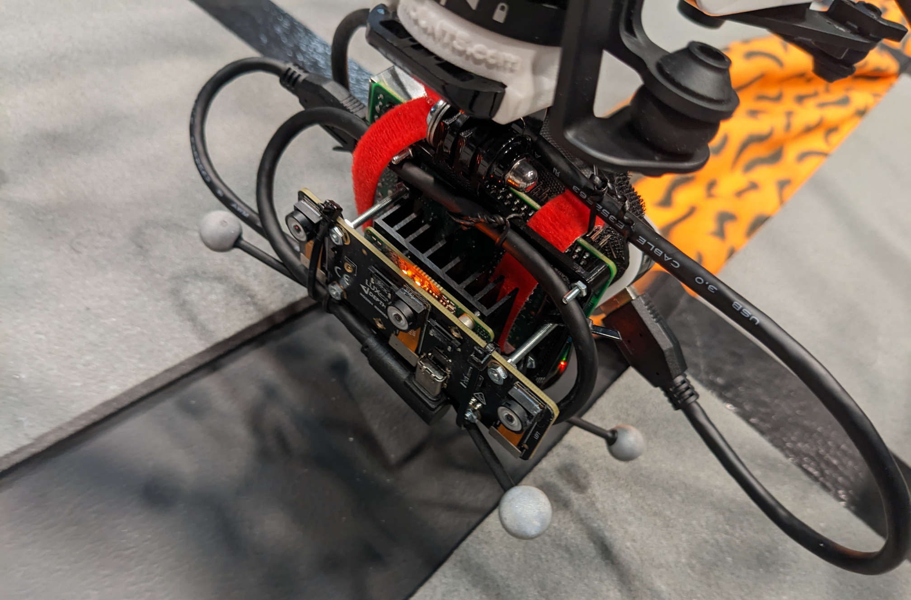
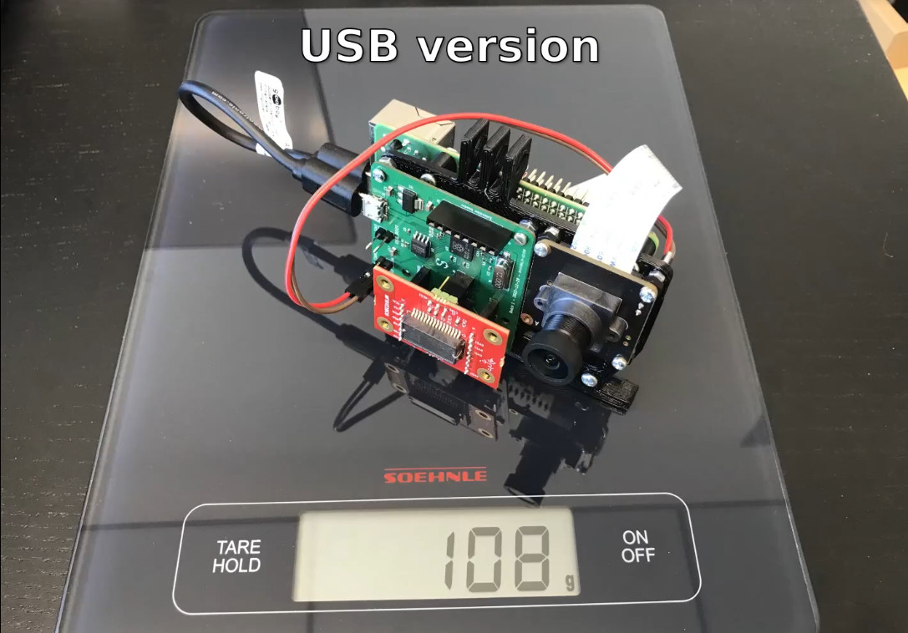

# Hardware setup

Data was recorded on two different payload devices mounted on an off-the-shelf DJI drone. In both cases, the recording device was powered by an independent USB power bank (instead of the drone battery).

## Device 1

Device 1 was built solely from off-the-shelf components which were attached to a simple 3D printed rig. These were

 * Raspberry Pi 4 Model B
 * Luxonis OAK-D Pro W ([development kit](https://shop.luxonis.com/products/oak-d-pro-w-dev))

The OAK-D Pro W kit is very similar to a normal OAK-D Pro W with the metal enclosure removed (or OAK-D Wide, since the IR projector was not used). The following data was recorded from the device onto the SD card in the Raspberry Pi SBC:

 * Monochrome stereo camera data from the OV9782 global shutter camera sensors (150° DFOV) at 30 frames per second and 400p resolution
 * Uncalibrated IMU data ([BNO085](https://www.ceva-dsp.com/product/bno080-085/)) at maximum frequency (~400Hz)

The weight of the recording device without the battery was 125g.

## Device 2

The second device used lower-level components, requiring more hardware integration. It consisted of

 * Raspberry Pi 4 Model B
 * InnoMaker OV9281 camera module (wide angle)
 * Spectacular AI IMU board v2, which consists of:
   - RP2040 microcontroller
   - ICM-46882-P IMU
   - Murata SCHA643 IMU
   - GPIO camera trigger pins

The following data was recorded on this device:

 * Monochrome camera data from the OV9782 at 30FPS. Resolutions 400p and 800p were used
 * IMU data from both devices at 600Hz

The weight of this device without the battery was 100g.

## OptiTrack ground truth

OptiTrack was used as a reference measurement.

# Dataset

The dataset contains sequences with the different devices and settings as follows:

 * Calbration sequences for both devices
 * Test sequences for device 1
 * 400p resolution sequences on device 2
 * 800p resolution sequences on device 2

# Data format

The first release of the dataset contains the raw calibration sequences as well as approximately aligned OptiTrack-based position trajectories. The extrinsic calibration accuracy is approximately 5 centimeters. Time synchronization was computed offline by comparing the OptiTrack orientations to raw gyroscope data. This method yields a synchronization accuracy of < 10ms.

The data is stored in the format described in <https://github.com/SpectacularAI/benchmark>.

# Changelog

 * **2023-04-72** Dataset announced

# License

The data will be licensed under [CC BY 4.0](https://creativecommons.org/licenses/by/4.0/)
